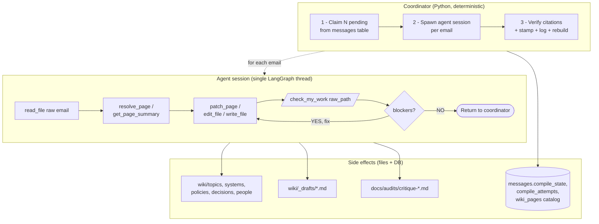

# Compile pipeline — architecture

How raw emails become wiki pages. Two diagrams: the **pipeline**
(coordinator + agent + feedback loop) and the **agent internals**
(LangGraph topology + tool inventory). The agent section is
auto-extracted from the live `create_compiler()` build; regenerate after
adding/removing tools with:

```bash
uv run python scripts/dump_agent_diagram.py
```

For the reader-facing shape (page types, status values, domain hubs),
see [`docs/NORTH-STAR.md`](./NORTH-STAR.md). For agent-facing schema and
tool conventions, see [`../CLAUDE.md`](../CLAUDE.md). This doc only
covers the flow — who calls what, in what order, with what side
effects.

## Pipeline (single-thread feedback loop)

The coordinator handles deterministic bookkeeping (claim, stamp, log,
catalog-sync, landing-page rebuild). The agent runs one LangGraph
session per email, ending with a `check_my_work` self-critique gate
before returning. **LLMs propose, coordinators verify.**



### Coordinator responsibilities (not agent-visible)

These live in `scripts/compile_all.py` (and the parallel/watch variants).
The agent cannot call them and does not need to:

- **Claim a batch** — `SELECT ... FROM messages WHERE compile_state = 'pending'`
  with `FOR UPDATE SKIP LOCKED`, flip to `claimed`.
- **Verify content-type citation** — after the agent returns, scan the
  wiki for each raw file's path. Only flip `compile_state = 'compiled'`
  when the raw path is cited in a **content-type page** (topic / system
  / policy / decision). People-only citation does not count.
- **Stamp `last_compiled` / `updated_by` / `update_count`** on every
  wiki page whose mtime advanced during the run
  (`_stamp_recently_modified_pages` in `scripts/compile_all.py`).
- **Append one structured row per batch to `wiki/log.md`**.
- **Regenerate landing surfaces** — `update_wiki_index` +
  `rebuild_landing_pages` rewrite `wiki/home.md`, every
  `wiki/<section>/index.md`, the 8 `wiki/domains/<slug>.md` hubs,
  `wiki/glossary.md`, `wiki/changes.md`, and decision stubs.
  `wiki/changes.md` is generated from `compile_attempts` — the agent
  must never touch it.
- **Sync catalog** — `src/db/wiki_pages.py::upsert_wiki_page` refreshes
  the Postgres `wiki_pages` table so `resolve_page` stays fast.

## Agent internals

### LangGraph topology

The agent is a Deep Agents (LangGraph) ReAct loop with one `before_agent`
middleware (patches tool-call ids) and one `after_model` middleware
(todo router). Auto-extracted from `agent.get_graph()`:

<!-- BEGIN: agent-graph -->
```mermaid
flowchart LR
    start([__start__])
    model[model<br/>(LiteLLM)]
    tools[tools]
    todo[/todo_router/]
    patch[/patch_tool_calls/]
    terminus([__end__])
    patch --> model
    todo -.-> terminus
    todo -.-> model
    todo -.-> tools
    start --> patch
    model --> todo
    tools -.-> model
```
<!-- END: agent-graph -->

### Tools loaded into the `tools` node

Custom tools come from `src/compile/compiler.py`. Filesystem and
workflow tools come from Deep Agents middleware defaults. Note: **there
is no `execute` tool** — shell execution is OFF by design; the agent
can only read, write, and edit files inside `raw/` and `wiki/`.

| Tool | Source | Purpose |
|------|--------|---------|
| `find_new_sources` | `src/compile/compiler.py::find_new_sources` | Filter-aware search for uncompiled emails (date range, sender/subject substring, thread). Capped at 200 rows; paginate for larger pulls. Reads from Postgres `messages`. |
| `list_wiki_pages` | `src/compile/compiler.py::list_wiki_pages` | Catalog browse grouped by category (topics, entities, systems, policies, timelines, conflicts). Call once at session start to learn valid wikilink targets. |
| `resolve_page` | `src/compile/compiler.py::resolve_page` | Normalized slug/title/email lookup. On miss, returns up to 5 substring candidates so the agent doesn't retry with slug variants. Returns `{exists, slug, title, page_type, path, status, confidence}` on hit. |
| `create_entities` | `src/compile/compiler.py::create_entities` | Resolve-or-create people pages in one batched call. Takes `raw_paths` + `list[EntityRequest]`. Identity is email — slugs are derived deterministically (never invented by the LLM). Gates new-page creation on evidence strength (CC-only = weak; refused unless `force=true`). |
| `get_page_summary` | `src/compile/compiler.py::get_page_summary` | Title + first paragraph + H2 headings + source count for a slug. Decision tool: "should I merge into this page or create a new one?" without paying for the full body. |
| `get_thread_context` | `src/compile/compiler.py::get_thread_context` | Chronological thread preview — every `messages` row matching `thread_id`, each with a 200-char body preview. Cap defaults to 50; returns `truncated: bool`. |
| `write_draft_page` | `src/compile/compiler.py::write_draft_page` | Write to `wiki/_drafts/<slug>.md`. Hidden from readers (`exclude_docs` in `mkdocs.yml`). Use when a wikilink target might not deserve a full page yet. |
| `patch_page` | `src/compile/compiler.py::patch_page` | Section-aware mutation — replace one H2's body, leave frontmatter and other sections untouched. Writes atomically. Use for targeted edits (e.g. refreshing "Current state" with new info); prefer over `edit_file` when the change fits one section. |
| `validate_page_draft` | `src/compile/compiler.py::validate_page_draft` | Cheap pre-flight for new pages: flags missing TL;DR, over-quoting (>30% blockquote lines), weak people pages, and likely duplicates. |
| `check_my_work` | `src/compile/compiler.py::check_my_work` | Deterministic hygiene gate over pages citing this email as a source. Flags malformed frontmatter, duplicate H2s, broken wikilinks, stray brackets, H1-in-body. Writes an audit to `docs/audits/critique-<ISO>-<msgid>.md` every call. Does **not** flip DB state — that's coordinator-owned. Synthesis quality is handled separately (reviewer subagent — see `docs/BACKLOG.md`). |
| `log_insight` | `src/compile/compiler.py::log_insight` | Structured trace annotation (`topic_merge_candidate`, `question_for_human`, `prompt_ambiguity`, `tool_gap`, `supersession_doubt`, `structure_suggestion`). Surfaces in the post-batch audit log for human review. |
| `read_file`, `write_file`, `edit_file`, `ls`, `glob`, `grep` | Deep Agents · file ops | Filesystem I/O over `raw/` + `wiki/` only. Absolute paths and `..` traversal are blocked. |
| `task`, `write_todos` | Deep Agents · workflow | Subagent launcher + structured todo list. |

### Tools that look like tools but aren't agent-visible

These live in `src/compile/compiler.py` for manual ops and coordinator
use, but are **NOT** passed into `create_compiler`:

- `stamp_page_compiled_at` — coordinator stamps pages after the run.
- `mark_as_compiled` — coordinator flips `compile_state` after
  citation verification.
- `append_to_log` — coordinator writes one structured batch row per run.
- `update_wiki_index` — coordinator regenerates after every run.
- `list_uncompiled_emails` — deprecated; the coordinator passes the
  batch file list in the user instruction. Letting the agent browse
  the whole queue was pure context tax.

See [`../CLAUDE.md`](../CLAUDE.md) § "Tool/coordinator split" for the
design rationale.

## Page taxonomy (current)

Defined in [`docs/NORTH-STAR.md`](./NORTH-STAR.md). Summary:

- **Visible in nav**: `topic`, `system`, `policy`, `glossary`
- **Lazy / hidden**: `decision` (linked from topics), `people`
  (linked from topics)

Status values: `active` | `superseded` | `archived`. Legacy
`current`/`superseded`/`contested` are still accepted in frontmatter
and at the catalog level during transition — the viewer's status pill
mapping in `mkdocs_hooks.py::_STATUS_LABELS` handles both vocabularies.

Directories dropped in the 2026-04-15 consolidation: `timelines/` and
`conflicts/` (zero pages after 2 weeks, no real use case).

## Backend

`FilesystemBackend(virtual_mode=True, root_dir=cwd)` — `read_file`,
`write_file`, `edit_file`, `ls`, `glob`, `grep` operate on real disk
under the current working directory. Absolute paths and `..` traversal
are blocked.

## Render pipeline

MkDocs builds `site/` from `wiki/`. Key moving parts:

- `mkdocs.yml` — curated nav (Home, Domains, Topics, Products &
  Platforms, Policies, Glossary, Changes, About). `_drafts/` is
  excluded from the build.
- `mkdocs_hooks.py::on_page_markdown` decorates every page with:
  - A status pill (`active` / `superseded` / `archived`, mapped from
    legacy `current`/`contested`).
  - A provenance banner (`N sources · last compiled YYYY-MM-DD · status: X`).
  - A collapsible `## Sources` block rendering each `raw/*.md` inline
    with sender / role context (✍️ sent, 📬 to, 📋 cc'd, 💬 mentioned).
  - Attachment-ref rewrites (`raw/attachments/*` → excluded marker).
  - The external-contact badge on people pages where
    `is_external: true`.
- `roamlinks` plugin renders `[[wikilinks]]` as clickable links.

## Rich (Excalidraw) versions

Hand-drawn equivalents of the diagrams above — useful when editing
visually, but **not auto-updated** when code changes:

- `docs/diagrams/compile-pipeline.excalidraw`
- `docs/diagrams/compile-agent-arch.excalidraw`

Open by drag-and-drop into [excalidraw.com](https://excalidraw.com).
