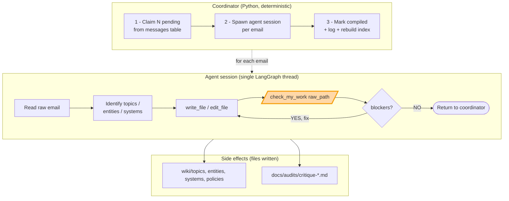

# Compile pipeline — architecture

Two diagrams: the **pipeline** (coordinator + agent + feedback loop) and the
**agent internals** (LangGraph topology + tool inventory). The agent section
is auto-extracted from the live `create_compiler()` build; regenerate after
adding/removing tools with:

```bash
uv run python scripts/dump_agent_diagram.py
```

## Pipeline (single-thread feedback loop)

The coordinator handles deterministic bookkeeping (claim, log, mark
compiled). The agent runs one LangGraph session per email, ending with a
`check_my_work` self-critique gate before returning.



## Agent internals

### LangGraph topology

The agent is a Deep Agents (LangGraph) ReAct loop with one `before_agent`
middleware (patches tool-call ids) and one `after_model` middleware (todo
router). Auto-extracted from `agent.get_graph()`:

<!-- BEGIN: agent-graph -->
```mermaid
flowchart LR
    start([__start__])
    model[model<br/>(LiteLLM)]
    tools[tools]
    todo[/todo_router/]
    patch[/patch_tool_calls/]
    terminus([__end__])
    patch --> model
    todo -.-> terminus
    todo -.-> model
    todo -.-> tools
    start --> patch
    model --> todo
    tools -.-> model
```
<!-- END: agent-graph -->

### Tools loaded into the `tools` node

Auto-extracted from the live `agent.nodes['tools'].bound.tools_by_name`
mapping. Anything classified as `custom` is one of ours
(`src.compile.compiler`); the rest are Deep Agents middleware-registered
defaults.

<!-- BEGIN: agent-tools -->
| Tool | Source | First line of docstring |
|------|--------|------------------------|
| `create_entity` | custom | Resolve or create an entity page by EMAIL. Call this INSTEAD of |
| `find_new_sources` | custom | Filter-aware search for uncompiled email sources. Returns paginated results. |
| `list_uncompiled_emails` | custom | List raw email files that haven't been compiled yet. |
| `list_wiki_pages` | custom | List all existing wiki pages grouped by category. |
| `log_insight` | custom | Record a structured meta-observation during compile. |
| `resolve_page` | custom | Find the canonical wiki page for a slug, title, or entity email. |
| `write_draft_page` | custom | Write a draft page to wiki/_drafts/{slug}.md. Hidden from readers. |
| `edit_file` | Deep Agents · file ops | Performs exact string replacements in files. |
| `glob` | Deep Agents · file ops | Find files matching a glob pattern. |
| `grep` | Deep Agents · file ops | Search for a text pattern across files. |
| `ls` | Deep Agents · file ops | Lists all files in a directory. |
| `read_file` | Deep Agents · file ops | Reads a file from the filesystem. |
| `write_file` | Deep Agents · file ops | Writes to a new file in the filesystem. |
| `execute` | Deep Agents · workflow | Executes a shell command in an isolated sandbox environment. |
| `task` | Deep Agents · workflow | Launch an ephemeral subagent to handle complex, multi-step independent tasks with isolated context windows. |
| `write_todos` | Deep Agents · workflow | Use this tool to create and manage a structured task list for your current work session. This helps you track… |
<!-- END: agent-tools -->

## Backend

`FilesystemBackend(virtual_mode=True, root_dir=cwd)` — `read_file`,
`write_file`, `edit_file`, `ls`, `glob`, `grep` operate on real disk under
the current working directory. Absolute paths and `..` traversal are
blocked.

## Rich (Excalidraw) versions

These are the same diagrams as hand-drawn Excalidraw — useful when you
want to edit them visually, but **not auto-updated** when code changes.

- `docs/diagrams/compile-pipeline.excalidraw`
- `docs/diagrams/compile-agent-arch.excalidraw`

Open by drag-and-drop into [excalidraw.com](https://excalidraw.com).
