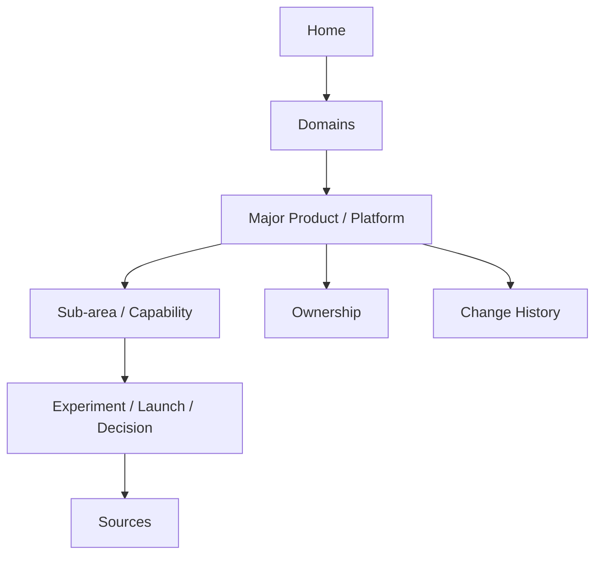
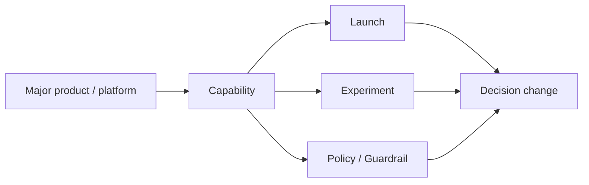
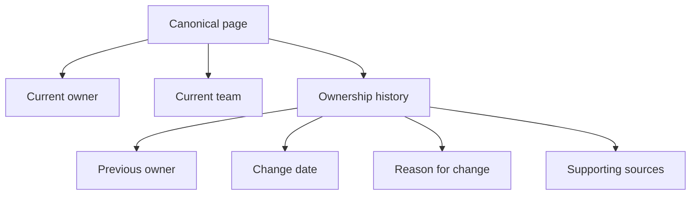

# User Personas and Knowledge Flows

This document translates the current wiki into actual user jobs:

- how someone learns the major products first
- how they drill into minor experiments
- how they understand who owns something now vs earlier
- how they understand how opinion changed over time, and why

It is based on a live audit of the current viewer and sample pages on April 13, 2026.

## What the live audit showed

### What is already working

- Some topic pages are already strong. `CrashAgent`, `Seller Specs Scaleup`, and
  `Personalised Buyer Dashboard - Msite` read like useful internal wiki pages.
- Source traceability is good. Readers can drill down from a compiled page to the
  underlying email.
- Full-text search works and can find a topic quickly if the user already knows
  the exact term.

### What is not working yet

- The home page is still a flat catalog, not a guided wiki.
- Entity pages are too ledger-like. They answer "what emails mentioned this
  person?" more than "what does this person own / influence?".
- System pages are inconsistent. Some are useful, some are extremely thin, and
  some are obvious stubs.
- Ownership is not consistently modeled as `current owner`, `previous owner`,
  `ownership changed on`, and `why ownership changed`.
- The wiki currently has no real `policies/`, `timelines/`, or `conflicts/`
  content, so changes in position are not surfaced as first-class knowledge.
- Readers can land on duplicates, weak slugs, and misclassified pages.

## The real user jobs

Most people are not trying to "browse markdown". They are trying to answer one of
these questions:

1. What are the major products / systems / programs the company runs?
2. What small experiments or recent launches are happening around them?
3. Who owns this now?
4. Who owned it earlier?
5. What changed in our view of this topic?
6. Why did that view change?

The wiki should be optimized for those jobs.

## Personas

### 1. Leadership / Strategy

This user wants breadth first, then depth.

Primary questions:

- What are the major product lines and strategic programs?
- Which areas are active right now?
- Which experiments are gaining momentum?
- Where is ownership clear, unclear, or changing?
- What has leadership opinion shifted on recently?

Needs:

- domain hubs
- major-product landing pages
- active bets / recent changes rollups
- current owner + previous owner
- rationale for changes, not just factual chronology

Failure mode today:

- They hit a giant flat index, then a mix of strong pages, stubs, and person-ledger pages.

### 2. Product Manager / Program Manager

This user wants current state plus adjacent context.

Primary questions:

- What is the current shape of this product or initiative?
- Which experiments sit under it?
- What launched, what is pending, and what got dropped?
- Who is implementing, sponsoring, or reviewing it?
- What assumptions changed after feedback, launch, or metrics?

Needs:

- product pages with nested experiments
- clear sections for current state, open questions, rollout, and ownership
- links to related experiments
- change log with reasons

Failure mode today:

- Topic pages can answer part of this, but discovery is manual and ownership history is weak.

### 3. Engineer / Operator

This user wants implementation context and provenance.

Primary questions:

- What is this system?
- Why was this decision made?
- What were the guardrails?
- What changed after failures or feedback?
- Which emails or threads justify the current implementation?

Needs:

- strong topic/system pages
- technical context
- source drilldown
- explicit "decision changes" and "why"

Failure mode today:

- Good on source access, inconsistent on historical reasoning and system quality.

### 4. New Joiner / Cross-Functional Reader

This user does not know the slugs or the mailing-list language.

Primary questions:

- What are the important things I should know in this area?
- How do the product, the system, and the experiments relate?
- Who are the main people involved?
- What terms or acronyms mean what?

Needs:

- domain hubs
- guided navigation
- plain-language summaries
- glossary / aliases
- "start here" entry points

Failure mode today:

- Search only works if the user already knows what to search for.

## Recommended browsing model

The right shape is breadth-first navigation with drilldown.



### What "proper use" should look like

An actual user should not begin with raw search unless they already know the term.

The primary path should be:

1. Start from a domain hub such as `Marketplace`, `Buyer`, `Seller`, `AI Agents`,
   `Search`, `Trust`, `Infra`, or `Growth`.
2. Open a major product/platform page.
3. See:
   - what it is
   - why it matters
   - current owner
   - previous owner(s)
   - major active topics / launches / experiments
   - recent important changes
4. Drill into a topic or experiment page only when needed.
5. Drill into sources only when trust or detail requires it.

That is the difference between a wiki and a ledger.

## Schema mapping

This document stays within the existing page schema from `CLAUDE.md`. The
recommended structures here should map to current page types like this:

| Proposed structure | Current schema mapping | Notes |
| --- | --- | --- |
| Domain hub | `topic` page with `navigation_role: domain_hub` | Not a new page type in Phase 1 |
| Major product / platform | `system` page | Use for durable products, platforms, services, tools, URLs, and mailing lists |
| Major program / initiative | `topic` page | Use when the parent is a durable program rather than a system |
| Capability page | `topic` page | Optional middle tier beneath a major product or domain hub |
| Experiment / launch / decision | `topic` page | Default unit for changes, launches, migrations, A/B tests, and rollouts |
| Policy / guardrail | `policy` page | Use when the durable object is a rule rather than a launch |
| Ownership history | Section inside `topic` / `system` / `policy` pages | Not its own page type |
| Opinion change | Section inside `topic` / `system` / `policy` pages | Not its own page type |
| Conflict / contested state | `conflict` page plus `status: contested` on affected pages | Use when disagreement cannot be resolved safely |
| Glossary / aliases | Curated navigation page or section inside a domain hub | Supporting navigation artifact, not a new canonical knowledge type |

The important constraint is:

- Phase 1 should not invent a new `hub` page type.
- Domain hubs should be implemented as reader-facing `topic` pages with a clear
  navigation role.
- Glossary / aliases should support navigation, not compete with canonical
  topic/system/entity pages.

## Domain hubs

Domain hubs are the top-level entry points a human should browse first.

Proposed canonical hubs:

- `Buyer`
- `Seller`
- `Marketplace`
- `Search & Discovery`
- `Trust & Safety`
- `Growth`
- `AI Agents & Automation`
- `Infra & Developer Platforms`

Each hub should summarize the area and route the reader into major products,
systems, current bets, and supporting glossary terms.

### Domain hub template

```markdown
# Buyer

## Summary
## Major Products & Platforms
## Active Programs & Experiments
## Important Policies & Guardrails
## Key Teams & Owners
## Glossary / Aliases
## Recent Changes
## Related Hubs
## Sources
```

## Major products vs minor experiments

This needs a deliberate hierarchy.

### Major product / platform pages

These should be durable and curated. They answer:

- what this thing is
- where it fits in the business
- what teams use or own it
- what the current strategic direction is
- what experiments or launches sit under it

Examples:

- `BuyerMY`
- `Marketplace Launch`
- `WhatsApp9696`
- `LEAP`
- `Photosearch`
- `CrashAgent` if it grows into a durable program rather than a one-off launch topic

### Minor experiment / launch pages

These should be narrower and time-bound. They answer:

- what changed
- who proposed it
- what was tested or launched
- what happened after launch
- what was learned
- whether it graduated, stalled, or got superseded

Examples:

- A/B test pages
- launch announcements
- rollout experiments
- prompt / agent / workflow POCs

### Capability pages

Capability pages are an optional middle tier. Use them only when a major product
or platform has multiple coherent sub-areas that users actually need to browse
separately.

Examples:

- `Search ranking`
- `Seller onboarding blockers`
- `Buyer messaging workflows`

Rule:

- If a major product has only a few directly related experiments, skip the
  capability tier and attach those experiments directly to the parent page.
- If a major product has multiple recurring sub-areas, use capability pages to
  avoid a flat pile of launches under the top-level parent.

### Relationship between them

Each experiment should roll up into a more durable parent area.



### Promotion criteria

An experiment should be promoted into a major product / platform / program page
only when at least two of the following are true:

1. It appears across `3+` independent threads or over a `30+` day span.
2. It has a named current owner or team and an ongoing roadmap.
3. It has `2+` child experiments, launches, policies, or recurring decisions.
4. It behaves like reusable company infrastructure, a durable product surface,
   or a long-running program rather than a one-time rollout.

If these signals are not present, keep it as an experiment / launch topic.

### Parent selection and hierarchy enforcement

The compile loop needs an explicit rule here:

1. If a clear durable parent already exists, attach the experiment to it.
2. If a parent does not exist but the parent clearly meets promotion criteria,
   create the parent page and attach the child.
3. If the parent is ambiguous or under-evidenced, do not create a visible stub
   major-product page. Keep the child page, mark parent selection as pending,
   and send the unresolved parent decision to the hidden draft / review queue.

This avoids both over-creating visible stubs and losing the child insight.

## Ownership now vs earlier

Ownership has to be explicit, not inferred from who appeared on email.

Every major product, system, and durable topic should expose:

- `Current owner`
- `Current team`
- `Prior owner(s)`
- `Ownership changed`
- `Why ownership changed`
- `Key stakeholders`

### Ownership model



### Important rule

Do not use entity pages as the primary source of ownership truth.

Entity pages should support discovery:

- what this person is most associated with
- what they currently own
- what they previously owned

But the canonical truth about ownership belongs on the product/system/topic page.

### Why ownership changes

Ownership change reasons should be normalized just like opinion-change reasons.

- org restructuring
- launch-to-operations handoff
- platformization / shared-service move
- scope split or scope merger
- staffing or backfill change
- executive direction
- incident / risk reassignment
- business priority change

### Sync rule

Ownership truth should flow in one direction:

1. Canonical `topic` / `system` / `policy` page owns the current and historical
   ownership record.
2. Entity pages mirror that record for discovery and should be regenerated or
   synced from the canonical pages.
3. If an entity page and a canonical page disagree, the canonical page wins and
   the entity page should be treated as stale.

## How opinion changes over time

This is the missing layer right now.

The current wiki preserves facts better than it preserves changing interpretation.
That is why it can feel "basic" even when the source coverage is strong.

Opinion change should be modeled as:

1. prior position
2. current position
3. what changed
4. why it changed
5. confidence in the new position
6. evidence supporting the change

### What counts as an opinion change

- "we should launch this" -> "we should hold rollout"
- "this architecture is enough" -> "this will not scale"
- "this metric looked good" -> "feedback shows this hurts users"
- "this team owns it" -> "ownership should move"
- "this rule is okay" -> "this creates risk and needs a blocker"

### Why opinion changes

These reasons should be normalized and captured explicitly:

- new metrics or launch outcomes
- customer or user feedback
- implementation complexity
- operational failures / incidents
- leadership direction
- resource or org changes
- policy / compliance / risk concerns
- dependency changes
- better alternative discovered

### Required page structure for opinion change

Every durable topic/system page should eventually support this section:

```markdown
## Current View

Short statement of the present position.

## How the View Changed

| Date | Previous view | Current view | Why it changed | Confidence | Source |
| --- | --- | --- | --- | --- | --- |
| 2026-04-10 | Scale this immediately | Keep single-repo for now | Multi-repo support not ready | Medium | raw/... |

## Decision Drivers

- Launch results
- User feedback
- Infra constraints

## Open Questions

- What evidence would change the recommendation again?
```

This is where the wiki becomes strategic rather than merely archival.

## What the current product is missing

The live audit suggests these missing capabilities are the main blockers:

### 1. Domain hubs

Without them, users cannot move from major areas to minor topics naturally.

### 2. Ownership as first-class knowledge

Today it is sometimes implied by a `Team` section, but not modeled consistently.

### 3. Change-of-view sections

There are no real timelines, conflict pages, or policy histories yet. That means
the wiki is weak at showing "how we got here".

### 4. Rollups for active experiments

A major product page should surface:

- active launches
- recent experiments
- superseded experiments
- open decisions

### 5. Better entity pages

Entity pages should summarize current role in the knowledge graph, not act as a
running email participation log.

### 6. Freshness and disambiguation

Readers need to know when:

- a page is current vs superseded vs contested
- a search result is ambiguous
- a page is thin and should not be trusted as a complete answer

## Recommended page templates

### Domain hub page

```markdown
# Buyer

## Summary
## Major Products & Platforms
## Active Programs & Experiments
## Important Policies & Guardrails
## Key Teams & Owners
## Glossary / Aliases
## Recent Changes
## Related Hubs
## Sources
```

### Major product / platform page

```markdown
# BuyerMY

## Summary
## Why It Matters
## Current State
## Current Owner
## Current Team
## Ownership History

| Date | Previous owner | New owner | Why ownership changed | Source |
| --- | --- | --- | --- | --- |

## Active Experiments
## Capability Areas
## Current View
## How the View Changed
## Important Recent Changes
## Risks / Open Questions
## Related Topics
## Sources
```

### Experiment / launch page

```markdown
# Dynamic Smart RFQ Form

## Summary
## Parent Area
## Parent Type
## Goal
## What Changed
## Rollout / Status
## Current Owner
## Why This Direction Was Chosen
## What Changed Since Initial Proposal
## Related Experiments
## Sources
```

### Entity page

```markdown
# Amit Agarwal

## Summary
## Current Areas of Involvement
## Current Ownership Mirror
## Previous Ownership Mirror
## Key Strategic Decisions Influenced
## Related Products / Systems
## Sources
```

## Acceptance scenarios

The wiki is materially better only if these scenarios work.

### Scenario A: Leadership maps the area

Goal:

- "Show me the major buyer-side products and the important active experiments under each."

Pass condition:

- This can be answered by browsing from Home -> Domain -> Product page without needing slug knowledge.

### Scenario B: PM drills from a product into the right experiments

Goal:

- "I am on BuyerMY. Show me the active experiments, the superseded ones, and what assumptions changed after launch feedback."

Pass condition:

- One canonical product page exposes current state, active experiments, and
  change-of-view summaries without requiring raw search.

### Scenario C: PM or leader understands ownership

Goal:

- "Who owns BuyerMY now, who owned it earlier, and what changed?"

Pass condition:

- One canonical page answers this directly, with dates and source-backed rationale.

### Scenario D: Engineer understands why the team changed direction

Goal:

- "Why did the team move from position A to position B?"

Pass condition:

- The page includes a structured change-of-view section and links to the source emails.

### Scenario E: Engineer or operator understands what changed after failures or feedback

Goal:

- "What changed after the launch feedback, incident, or operational problem?"

Pass condition:

- The page clearly separates decision history from operational change history and
  links each change to the source evidence.

### Scenario F: New joiner learns the landscape

Goal:

- "I know nothing about this area. Help me understand the major things, then the experiments."

Pass condition:

- Domain hubs, glossary links, and curated rollups are sufficient without raw search.

### Scenario G: Reader sees a contested claim

Goal:

- "Two pages or threads disagree. Show me the current disagreement and where to verify it."

Pass condition:

- A `conflict` page exists, affected pages show `status: contested`, and the
  reader can see both positions with sources.

### Scenario H: Reader understands freshness

Goal:

- "Is this page still current, or am I reading stale or superseded information?"

Pass condition:

- The viewer surfaces freshness and status clearly enough that the reader can
  distinguish `current`, `superseded`, and `contested` without reading the raw email.

### Scenario I: Reader hits an ambiguous or empty search

Goal:

- "I searched for a name or term and got multiple similar matches, or no exact match."

Pass condition:

- The viewer offers disambiguation, aliases, or adjacent suggestions instead of
  dropping the reader into a dead end.

## Immediate implementation implications

This analysis implies a few concrete changes, in order:

1. Define the schema mapping and ship domain hubs as `topic` pages with an
   explicit navigation role rather than inventing a new page type.
2. Change the home page into a domain map that routes readers into those hubs.
3. Ship stronger major product / program / experiment templates, including
   promotion criteria and parent-selection rules.
4. Move ownership into canonical topic/system/policy pages and treat entity
   ownership as a synced mirror, not a separate truth source.
5. Add change-of-view sections, freshness signals, and contested/conflict
   surfaces so the reader can understand not just facts but interpretation.
6. Add glossary / alias and disambiguation support so new joiners can navigate
   without already knowing internal slugs.
7. Rework entity pages into concise supporting summaries rather than activity ledgers.

## Bottom line

If this wiki is meant to help humans reason about the company, then it has to
preserve three things at the same time:

- current state
- historical change
- rationale

Today it preserves evidence reasonably well and summary unevenly well. The next
step is to preserve interpretation: what changed in thinking, and why.
