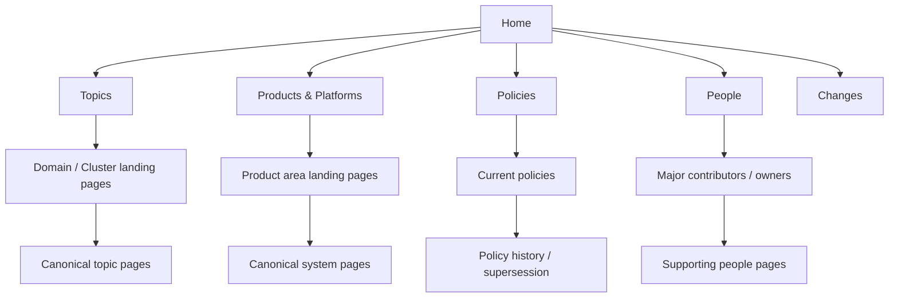
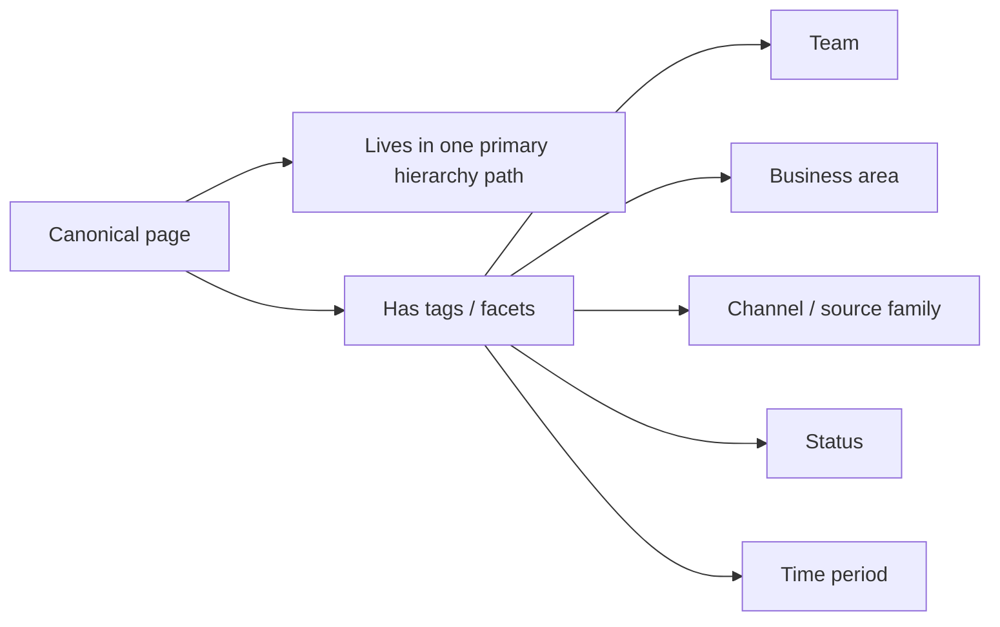
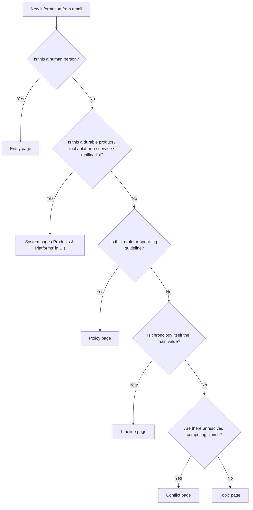
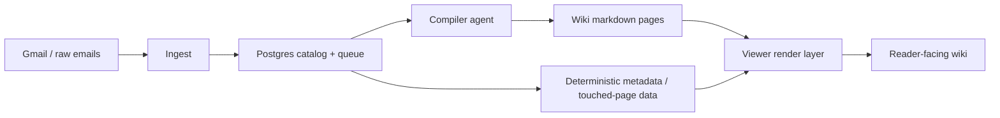
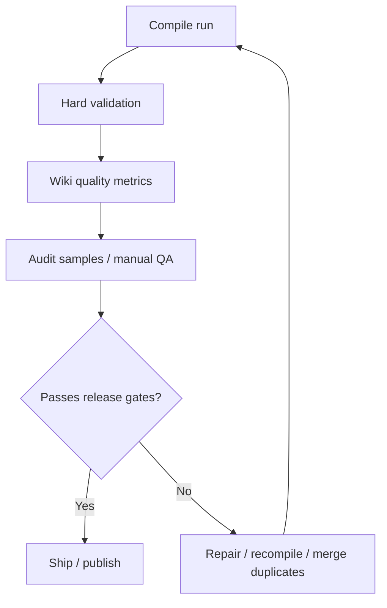
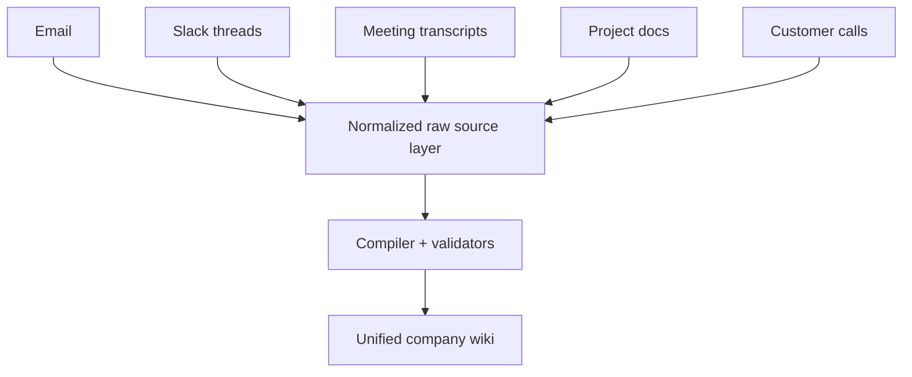
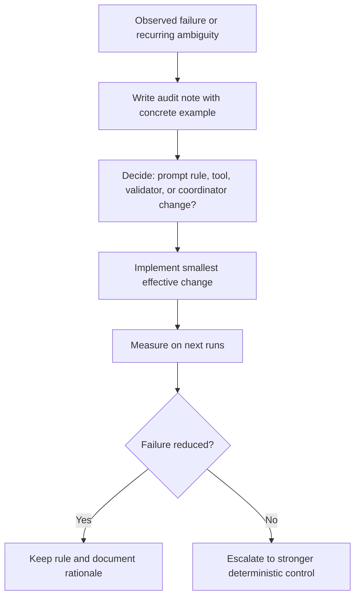

# Issue: Phase 1 Implementation Plan — Real Internal Wiki

**Labels**: `documentation`, `architecture`, `phase-1`, `implementation-plan`

---

## Executive summary

The current system already ingests email, compiles wiki pages, and serves them
through MkDocs. What it does **not** yet do reliably is produce a polished
internal wiki.

The core problem is structural:

- the wiki is too flat
- navigation is too file-driven
- entity pages are too prominent
- references are too loud
- the compiler still creates reader-visible clutter to recover from ambiguity

This plan turns the current pipeline into a topic-first, reference-backed,
hierarchical internal wiki that developers can implement incrementally.

The recommended approach is:

1. Clarify page taxonomy and reader hierarchy.
2. Move provenance and lookup logic out of the LLM where possible.
3. Make the viewer render a curated hierarchy instead of a filesystem dump.
4. Reduce noisy page creation and visible stub pollution.
5. Add verification gates so the wiki cannot silently regress.

---

## What success looks like

A new reader should be able to:

- land on the home page
- browse by subject area without knowing filenames
- find the canonical page for a product, initiative, or policy
- see what is current, what changed, and what is uncertain
- inspect source evidence without the page becoming an email dump

Developers and operators should be able to:

- reason about where a page belongs
- predict when a new page is created versus an existing page updated
- run automated checks that catch taxonomy drift, duplicates, corruption, and evidence gaps
- roll changes out in small PRs with clear acceptance criteria

---

## Non-goals for Phase 1

Do not treat these as blockers for this phase:

- semantic search
- chat / QA over the wiki
- multi-mailing-list scale
- deep folder hierarchies in the repo
- perfect historical cleanup of every legacy page before shipping improvements

Phase 1 is about making the wiki **good enough to deserve automation**.

---

## Core design decisions

### 1. Keep storage shallow, make reading hierarchical

The repository can stay shallow:

- `wiki/topics/`
- `wiki/systems/`
- `wiki/entities/`
- `wiki/policies/`
- `wiki/timelines/`
- `wiki/conflicts/`

But the viewer should become more hierarchical:

- top-level section pages
- cluster / domain landing pages
- canonical content pages beneath those landing pages

### 2. Keep `system` internally, label it better for readers

The internal page type can remain `system`, but the UI should present it as:

- `Products & Platforms`

That is clearer to non-technical readers than `Systems`.

### 3. Treat `topics` as the main product

`Topics` are where changing knowledge lives:

- rollouts
- incidents
- decisions
- migrations
- experiments

`Systems` are durable nouns:

- products
- platforms
- tools
- services
- mailing lists

### 4. Preserve evidence, but layer it

The page should lead with knowledge. Evidence should sit behind metadata,
compact references, and expandable raw details.

### 5. Push deterministic work into tools and coordinators

The compiler agent should synthesize knowledge, not invent identity, canonical
slugs, page merges, or navigation structure ad hoc.

### 6. Use hierarchy for browsing, tags for slicing

This should not be a choice between hierarchy and tags. A large company wiki
needs both.

- **Hierarchy** is for human navigation.
- **Tags / facets** are for filtering, rollups, and alternate cuts.

Hierarchy should answer:

- where do I start
- what cluster does this belong to
- what is the canonical page

Tags should answer:

- which teams touched this
- which channel or source family this came from
- which business area this belongs to
- which lifecycle state it is in

Recommended rule:

- do **not** use tags as the primary information architecture
- do use tags to generate views, rollups, and filters on top of the hierarchy

---

## Target information architecture

### Reader hierarchy



### Hierarchy plus tags



### Taxonomy decision tree



### Compile and render flow



### Verification loop



---

## Page definitions

### Topic

A topic answers:

- what is happening
- what changed
- what decisions were made
- what remains open

Examples:

- city-based filters on Lens results page
- complaint agent v2 on WhatsApp 9696
- buyer payment protection banner rollout

### System

A system answers:

- what this thing is
- what role it plays
- which topics are happening around it

Examples:

- Lens
- WhatsApp 9696
- TrustPulse, if treated as a durable product

### Topic vs system rule

- If the page is mostly about **status and change**, it is a `topic`.
- If the page is mostly about **the thing itself**, it is a `system`.

When both are needed:

- one canonical `system` page for the durable thing
- multiple `topic` pages for rollouts, migrations, incidents, or initiatives involving that thing

### Policy

A policy is a rule, approval flow, guideline, or procedure with a current state.

### Entity

An entity is a human person only. The page should summarize meaningful
involvement, not act as an exhaustive CC ledger.

### Timeline

Use only when chronology is the point, not by default.

### Conflict

Use when the system cannot honestly collapse competing claims into one current truth.

---

## Required page templates

### Topic page

Required sections:

1. `Summary`
2. `Current state`
3. `Why it matters`
4. `Key decisions`
5. `Recent changes`
6. `Open questions`
7. `Related pages`
8. `References`

### System page

Required sections:

1. `Summary`
2. `Role / purpose`
3. `Active related topics`
4. `Dependencies / related systems`
5. `Known issues or changes`
6. `Related pages`
7. `References`

### Policy page

Required sections:

1. `Current policy`
2. `Who it affects`
3. `Effective date`
4. `Supersedes / superseded by`
5. `History`
6. `References`

### Entity page

Required sections:

1. `Who this is`
2. `Areas of involvement`
3. `Major related topics`
4. `Major related systems`
5. `Recent material contributions`
6. `References`

### Timeline page

Required sections:

1. `Scope`
2. `Chronology`
3. `Current status`
4. `Related pages`
5. `References`

### Conflict page

Required sections:

1. `Question in dispute`
2. `Position A`
3. `Position B`
4. `Evidence`
5. `Resolution path`
6. `Affected pages`
7. `References`

---

## Workstreams

## Workstream 1 — Taxonomy and templates

### Goal

Make page-type decisions predictable and make all important page types render
consistently.

### Current issues

- `topic` vs `system` is unclear
- people pages and systems are sometimes miscategorized
- policies / timelines / conflicts exist conceptually but are underused
- pages vary too much in structure

### Changes

- codify topic vs system rules in prompts and docs
- add required section templates per page type
- add validator checks for section presence on key page types
- add UI labels that are clearer than raw internal names

### Code areas

- [src/compile/prompts.py](/Users/amtagrwl/.codex/worktrees/a70d/email-knowledge-base/src/compile/prompts.py)
- [scripts/validate_wiki.py](/Users/amtagrwl/.codex/worktrees/a70d/email-knowledge-base/scripts/validate_wiki.py)
- [mkdocs.yml](/Users/amtagrwl/.codex/worktrees/a70d/email-knowledge-base/mkdocs.yml)
- docs

### Deliverables

- stable page-type definitions
- section templates documented and enforced
- UI label change from `Systems` to `Products & Platforms`

### Acceptance criteria

- no new person pages created under `systems/`
- no new obvious products created under `entities/`
- topic and system pages render with predictable section order

---

## Workstream 2 — Viewer hierarchy and navigation

### Goal

Replace sidebar dumps and file-driven navigation with reader-facing structure.

### Current issues

- MkDocs auto-discovers the entire `wiki/` tree
- `index.md` acts as a giant catalog
- stub and duplicate pages leak into visible navigation
- there are no domain landing pages or rollups

### Changes

- define explicit top-level nav in `mkdocs.yml`
- create section landing pages
- create cluster / rollup pages for major domains
- hide stub pages and alias pages from main navigation
- surface canonical pages only
- support tag/facet-driven rollups without replacing the main hierarchy

### Proposed top-level navigation

- `Home`
- `Topics`
- `Products & Platforms`
- `Policies`
- `People`
- `Changes`
- `About`

### Proposed landing pages

- `wiki/home.md`
- `wiki/topics/index.md`
- `wiki/systems/index.md`
- `wiki/policies/index.md`
- `wiki/entities/index.md`
- `wiki/changes/index.md`

### Code areas

- [mkdocs.yml](/Users/amtagrwl/.codex/worktrees/a70d/email-knowledge-base/mkdocs.yml)
- [mkdocs_hooks.py](/Users/amtagrwl/.codex/worktrees/a70d/email-knowledge-base/mkdocs_hooks.py)
- generated wiki landing pages

### Acceptance criteria

- a reader can navigate to major subject areas without scanning raw filenames
- stub pages do not appear in primary navigation
- topic and system pages are easier to reach than people pages
- tag/facet views exist as secondary entry points, not as the only way to browse

---

## Workstream 3 — Provenance and references

### Goal

Keep evidence strong while reducing page clutter.

### Current issues

- full raw-email blocks are appended to every page
- large source lists dominate many pages
- frontmatter and sources are pulling the reader away from the synthesized content

### Changes

- keep source truth in frontmatter and catalog data for machine use
- render a compact metadata banner at the top
- render a compact `References` section by default
- make raw-email evidence expandable or separately linked
- cap visible source lists on noisy pages, especially entities
- support inline citations for sensitive claims when useful

### Code areas

- [mkdocs_hooks.py](/Users/amtagrwl/.codex/worktrees/a70d/email-knowledge-base/mkdocs_hooks.py)
- [scripts/compile_all.py](/Users/amtagrwl/.codex/worktrees/a70d/email-knowledge-base/scripts/compile_all.py)
- [src/db/wiki_pages.py](/Users/amtagrwl/.codex/worktrees/a70d/email-knowledge-base/src/db/wiki_pages.py)
- [src/db/touched_pages.py](/Users/amtagrwl/.codex/worktrees/a70d/email-knowledge-base/src/db/touched_pages.py)

### Acceptance criteria

- topic pages are readable without scrolling through large evidence blocks
- references remain one click away
- page trust improves without increasing clutter

---

## Workstream 4 — Compiler tooling and agent boundaries

### Goal

Reduce LLM guesswork and stop failure-recovery behavior from creating visible wiki damage.

### Current issues

- the agent still has too much responsibility for page discovery and merging
- missing references become stub pages
- duplicate pages and suffix variants still happen
- entity pages bloat because low-signal mentions are treated as material

### Changes

- add canonical page lookup and similar-page search tools
- add alias / redirect support for duplicate or legacy names
- add page-type classification helpers
- add structured page-update helpers for frontmatter and `Related`
- block user-visible stub creation as the default recovery path
- distinguish strong vs weak evidence for entity inclusion

### Recommended new tools

- `wiki_find_similar_pages`
- `wiki_resolve_page`
- `wiki_classify_page`
- `wiki_update_frontmatter`
- `wiki_update_related`
- `wiki_verify_quote`
- `wiki_merge_pages`
- `wiki_compact_entity_sources`

### Preferred tool shapes

Tool shapes should be:

- narrow
- deterministic
- self-validating
- named by job, not by implementation
- safe to compose

Good pattern:

- `wiki_resolve_page(name="lens", allowed_types=["system", "topic"])`
- returns canonical slug, type, confidence, aliases, and whether the page exists

Bad pattern:

- `search_everything(query)`
- returns an unstructured blob the model has to reinterpret each time

Examples:

#### `wiki_resolve_page`

```python
def wiki_resolve_page(
    name: str,
    allowed_types: list[str] | None = None,
) -> dict:
    """
    Returns:
    {
      "matches": [
        {
          "slug": "lens-indiamart",
          "title": "Lens",
          "page_type": "system",
          "confidence": 0.94,
          "aliases": ["lens", "lens.indiamart"]
        }
      ],
      "canonical": {
        "slug": "lens-indiamart",
        "page_type": "system"
      }
    }
    """
```

#### `wiki_find_similar_pages`

```python
def wiki_find_similar_pages(
    slug: str,
    page_type: str | None = None,
    threshold: float = 0.8,
) -> dict:
    """
    Returns ranked near-duplicates to stop suffix variants and spelling splits.
    """
```

#### `wiki_classify_page`

```python
def wiki_classify_page(
    title: str,
    raw_paths: list[str],
    candidate_slug: str | None = None,
) -> dict:
    """
    Returns:
    {
      "page_type": "topic",
      "reason": "describes a rollout/change rather than a durable product",
      "confidence": 0.88
    }
    """
```

#### `wiki_write_page`

```python
def wiki_write_page(
    slug: str,
    page_type: str,
    frontmatter: dict,
    body: str,
    expected_prior_hash: str | None = None,
) -> dict:
    """
    Writes only after validating:
    - YAML parses
    - page_type matches path
    - required sections exist
    - sources are unique
    """
```

#### `wiki_record_touch`

```python
def wiki_record_touch(message_id: str, slug: str) -> dict:
    """
    Deterministically records that a source message contributed to a page.
    """
```

#### `wiki_get_references`

```python
def wiki_get_references(
    slug: str,
    mode: str = "compact",
    limit: int = 20,
) -> dict:
    """
    Returns compact reader-facing references or full raw evidence links.
    """
```

#### `wiki_list_nav_nodes`

```python
def wiki_list_nav_nodes(section: str) -> dict:
    """
    Returns canonical landing pages, clusters, and visible children for the UI.
    """
```

### Tooling principles from the references

The referenced Anthropic material points in the same direction:

- tools should do one thing clearly
- overlapping tools confuse agents
- tool outputs should be structured and compact
- context should be curated, not maximized

That matches what this repo needs: fewer generic file operations in the main
loop, more wiki-shaped primitives.

### Agent responsibilities after refactor

- choose which durable pages need updating
- synthesize the page body from cited evidence
- create topic/system/policy/timeline/conflict pages only when warranted

### Coordinator / tool responsibilities after refactor

- identity
- canonical slugging
- duplicate detection
- touched-page recording
- provenance joins
- validation
- freshness stamping

### Code areas

- [src/compile/compiler.py](/Users/amtagrwl/.codex/worktrees/a70d/email-knowledge-base/src/compile/compiler.py)
- [src/compile/prompts.py](/Users/amtagrwl/.codex/worktrees/a70d/email-knowledge-base/src/compile/prompts.py)
- `new helper modules under src/compile/`

### Acceptance criteria

- duplicate suffix pages stop appearing in new runs
- missing-link recovery no longer creates reader-visible junk pages
- entity pages stop growing mainly due to CC-only mentions

---

## Workstream 5 — Legacy cleanup and migration

### Goal

Improve the existing corpus enough that the new viewer hierarchy shows good content.

### Current issues

- duplicates already exist
- some slugs are ambiguous or ugly
- many stubs have low value
- topic/system/entity category drift remains in the corpus

### Changes

- merge duplicate pages into canonical pages
- add alias pages or redirects for common legacy names
- demote or hide thin stubs from primary navigation
- run targeted backfills for high-value topic clusters
- create missing rollup pages for major domains

### Suggested cleanup order

1. duplicate topics and duplicate entities
2. miscategorized people vs systems
3. thin stubs with no meaningful content
4. canonical alias setup
5. rollup and landing page generation

### Acceptance criteria

- top 20 most-read areas have canonical landing pages
- obvious duplicate pages are merged or redirected
- the primary navigation exposes high-value pages, not cleanup debris

---

## Workstream 6 — Verification, QA, and release gates

### Goal

Make wiki quality measurable and block regressions.

### Verification layers

#### 1. Hard validation

These should fail the run:

- invalid YAML frontmatter
- missing required frontmatter
- invalid page_type or status
- duplicate bodies
- obvious suffix-duplicate pages
- empty body
- page stored in the wrong category

Potential additions:

- missing required sections on topic/system/policy pages
- stub pages leaking into primary nav
- unresolved canonical alias conflicts

#### 2. Structural quality metrics

Track these every run:

- page counts by type
- ratio of topics to entities to systems
- number of policies / timelines / conflicts
- number of stub pages
- number of effective orphans excluding `index.md`
- duplicate / alias counts
- average page size by type
- average visible source count by type
- number of pages touched per compile batch
- number of pages reachable only from `index.md`
- number of visible nav nodes per section

#### 3. Evidence quality metrics

Track these on samples and eventually automate more of them:

- source paths exist
- sources match the claims on the page
- quotes are actually present in cited raw files
- material claims on entity pages are not sourced only by CC presence

#### 4. Reader-experience QA

Test flows:

- find a known topic from the home page
- find the canonical page for a product
- distinguish current policy from superseded history
- trace from a topic to supporting evidence
- distinguish a person page from a topic page

### Release gates

Do not publish a build when any of these are true:

- hard validation fails
- duplicate canonical pages are present for the same concept
- stub pages appear in primary nav
- topic pages are outnumbered by entity pages in the main landing surfaces
- evidence rendering is broken or missing

---

## How to get it to reality

### Recommended PR sequence

Keep each PR narrow and shippable.

#### PR 1 — Taxonomy and labels

- clarify topic vs system rules in prompts and docs
- add UI label `Products & Platforms`
- add template expectations

#### PR 2 — Explicit navigation skeleton

- stop relying on full auto-discovery for main nav
- add landing pages and top-level nav
- hide non-reader-facing pages from primary navigation

#### PR 3 — References redesign

- compact metadata banner
- compact references rendering
- move raw-email blocks behind expansion or separate detail views

#### PR 4 — Tooling for canonical pages

- similar-page detection
- canonical page resolution
- alias / redirect support

#### PR 5 — Entity-page de-noising

- strong vs weak evidence rules
- cap visible sources
- reduce CC-only inflation

#### PR 6 — Cleanup and migration

- merge known duplicate pages
- demote stubs
- create initial rollups for major clusters

#### PR 7 — Verification gates

- expand validator
- add quality metrics
- add release checklist / QA script

#### PR 8 — Recompile and publish

- re-run targeted compile / repair
- verify against audit sampling
- publish updated viewer

### Rollout sequence


### Recommended ownership split

- Viewer / IA: MkDocs config, hooks, landing pages
- Compiler / tools: prompt rules, new tools, canonical resolution, compaction
- Catalog / DB: touched-page joins, page metadata, alias metadata if added
- QA / audit: validation, metrics, sample-based fact checks

---

## Verification plan

### Is `index.md` / `log.md` actually being used correctly?

Today: only partially.

- `index.md` is regenerated, but it is mostly a flat catalog with counts.
- `log.md` is appended to, but it is mainly an audit artifact, not a strong
  context source for reader-facing behavior.

What should change:

#### `index.md`

`index.md` should become a content-oriented map, not just a file inventory.

It should contain:

- top sections
- major clusters
- canonical page links
- one-line summaries
- freshness and status hints
- links to rollup pages

The agent should use it for:

- initial orientation
- finding canonical pages and clusters
- avoiding duplicate page creation

#### `log.md`

`log.md` should remain chronological, but should be more intentionally useful.

It should record:

- ingest runs
- compile runs
- repair runs
- duplicate merges
- policy supersessions
- significant nav changes

The agent should use it for:

- recent-change awareness
- repair context
- operator visibility

Recommended format:

- one structured heading or row per event
- stable fields for type, pages touched, message count, and outcome
- grep-friendly structure

### Evolving from email-only to full company knowledge

The long-term target should be:

- one compile architecture
- multiple source families
- one common knowledge model

Source families:

- email
- Slack threads
- meeting transcripts
- customer calls
- project documents
- tickets / bug trackers

Recommended model:

- keep each raw source immutable
- normalize each source into a shared raw schema
- compile all of them into the same wiki layer
- store source-family metadata for provenance and filters



### Evolving the schema / AGENTS.md correctly

The schema should be treated like a product contract, not a random prompt file.

Recommended process:

1. Version it explicitly.
2. Change it only when an observed failure justifies the change.
3. Link each meaningful rule to a real failure mode or desired behavior.
4. Prefer shrinking ambiguity over adding prose volume.
5. Move deterministic instructions into tools when possible.

Good schema evolution loop:



Rules of thumb:

- if the rule depends on stable identity, it probably belongs in code
- if the rule depends on output structure, it may belong in validation
- if the rule depends on nuanced synthesis, it belongs in the schema/prompt
- if the rule is repeatedly ignored, stop telling the model and build a tool

## 1. Automated checks in CI

Minimum CI for this phase:

- `uv run ruff check`
- `uv run pytest`
- `uv run python scripts/validate_wiki.py`
- a lightweight nav / rendering smoke check

Optional but recommended:

- generate the MkDocs site in CI
- fail if canonical landing pages are missing
- fail if stub pages appear in top-level nav exports

## 2. Batch-level compile verification

After each compile batch:

- validate `wiki/`
- record number of touched pages
- record number of source-bearing pages changed
- record duplicate / stub / orphan counts
- compare quality metrics against the previous run

## 3. Golden-path manual QA

Use a fixed set of representative subjects:

- one major topic
- one major product/system
- one policy
- one noisy person page
- one duplicate-prone area

For each, verify:

- canonical page is easy to find
- page type is correct
- current state is readable
- references are available
- related pages make sense

## 4. Audit sampling

Every release candidate:

- sample 5 topic pages
- sample 3 system pages
- sample 3 entity pages
- sample 1 policy page if present

Check:

- fidelity to cited evidence
- absence of unsupported role/ownership claims
- absence of wrong-source joins
- structural readability

## 5. Success metrics

Target directional improvements:

- fewer visible stub pages
- fewer duplicate canonical concepts
- more topic-first navigation clicks
- lower average visible evidence clutter on topic pages
- higher proportion of page-to-page navigation that does not depend on `index.md`
- more useful policies / timelines / conflicts where the content actually warrants them

---

## Risks and mitigations

| Risk | Why it matters | Mitigation |
|---|---|---|
| Over-engineering the hierarchy | Too much structure becomes maintenance burden | Keep storage shallow; put hierarchy in landing pages and generated nav |
| Taxonomy drift | People will still create ambiguous pages | Add tooling + validation + examples in prompts |
| Provenance gets weaker | Compact references can accidentally hide evidence | Keep expandable raw detail and audit evidence checks |
| Cleanup takes too long | Legacy corpus is messy | Focus first on high-traffic / high-value areas |
| Viewer and compiler diverge | Docs say one thing, output shows another | Use landing pages, validator checks, and release gates tied to rendered output |

---

## Definition of done for Phase 1

Phase 1 is complete when:

- the home page and landing pages provide a real browsing experience
- `Topics` and `Products & Platforms` are the main reader path
- the topic vs system distinction is clear in both compile behavior and UI
- reader-visible stub pollution is low
- references remain strong but layered
- duplicate and miscategorized page creation is materially reduced
- the build has automated gates that detect structural regressions

---

## Immediate next actions

1. Approve the taxonomy and reader hierarchy in this document.
2. Create PR 1 for taxonomy, labels, and template rules.
3. Create PR 2 for explicit nav and landing-page scaffolding.
4. Add verification gates before any broader live-ingest work.

This ordering matters. A faster bad wiki is worse than a slower good one.
